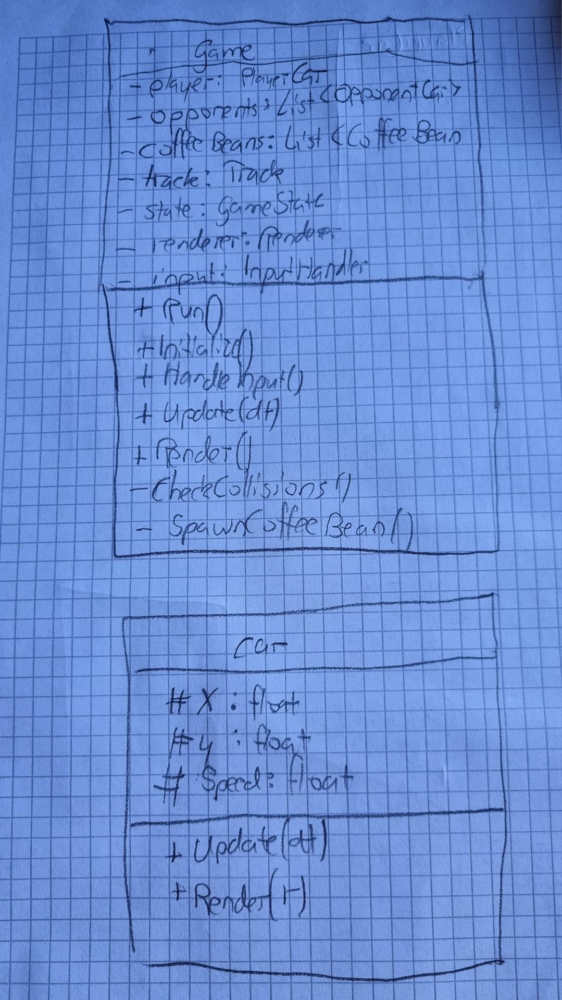

# Lern-Periode 6

22.8 bis 19.9.2024

## Grob-Planung

Ich habe mich für diese Lernperiode für eine eigene Projektidee entschieden. Dabei habe ich auch persönliche Aspekte in meine Spielidee einfliessen lassen ("Kaffee-Sucht").
Ich möchte ein einfaches aber funktionales Racing Game namens "caffeine Racer" entwickeln. Bei dem Spiel geht es darum nach dem start während einer begrenzten zeit an möglichst vielen gegnerischen Autos vorbei zu manövrieren. Dabei hat der Fahrer ein Müdigkeitslevel. Je müder der Fahrer wird, desto langsamer wird das Auto und wenn der Fahrer einschläft baut man einen Unfall und es ist Game-Over. Um so ein Szenario zu verhindern, muss man während dem Fahren Kaffeebohnen einsammeln um den Fahrer wieder wacher zu machen.
Zusammengefasst handelt es sich also um ein unterhaltsames Rennspiel mit einem speziellen Twist.

## 22.8

- [X] Arbeitspaket 1: Erstellen Sie ein Projekt im VS und beginnen Sie mir ersten Code-Skizzen. Das ist wichtig, Sie müssen heute bereits schon C#-Code hochladen!
- [ ] Arbeitspaket 2: Schreiben Sie eine Liste, welche Klassen und Objekte es braucht, und wie diese miteinander interagieren. Das Format ist Ihnen freigestellt, aber Sie müssen es auch bereits heute auf github laden.

Heute habe ich mir zunächst überlegt, was ich in dieser Lernperiode Programmieren könnte. Schon bald kam ich auf die Idee, ein Rennspiel zu entwickeln. Anschliessend begann ich bereits etwas darüber nachzudenken, wie ich den Code strukturieren sollte, also welche Klassen das Spiel benötigt und begann auch bereits damit diese Struktur im VS zu implementieren. Mit dem Implementieren eines funktionalen Aspektes konnte ich leider aus Zeitgründen nicht mehr beginnen.

## 29.8

- [X] Struktur: Offline weiter darüber Nachdenken welche Klassen noch benötigt werden und anschliessend mit der Festlegung der Klasseninternen Struktur beginnen
- [ ] Painter: Beginn der grundlegenden Implementation der Painter-Klasse (Draw-Funktion). Ausführliches Testen mit verschiedensten Formen, Bugs finden und beheben
- [ ] DRY-Prinzip: Redundante Stellen finden und in Methoden/Funktionen auslagern

Heute habe ich grösstenteils an der Code-Strukur des Spiels gearbeitet. Zunächst habe ich gut eine Stunde offline nochmals darüber nachgedacht welche weiteren Klassen noch benötigt werden und welche Funktionen und Eigenschaften diese dann jeweils erhalten. Ausserdem habe ich versucht die bereits bestehenden Klassen noch weiter zu verbessern. Ich habe sie also teilweise umbenannt und auch die Funktionalitäten überarbeitet. Dann begann ich damit die verbesserte Struktur in mein Projekt zu übernehmen und codierte auch bereits die Grundfunktion des Timers. Für weiteres reichte es mir Zeitlich leider nicht aber ich bin allgemein sehr zufrieden mit dem fortschritt den ich machen konnte.




## 5.9

- [X] Programmablauf: Erarbeiten eines sinnvollen und übersichtlichen Programmablaufplans um das Implementieren zu erleichtern (Offline)
- [X] Renderer: Implementation eines sinnvollen Gamerenderers um das grafische Geschehen korrekt anzuzeigen (Siehe Painter vom 29.8). Ausführlich Testen und falls möglich versuchen damit ein bestandteil des Spiels (Auto, Rennbahn. Kaffebohne etc.) anzuzeigen.
- [ ] Implementation der benötigten Logik in der Klasse `Game.cs` nach Programmablaufplan
- [ ] DRY-Prinzip: Den neuen code auf Redundanzen überprüfen und diese zusammenfassen (siehe DRY-Prinzip 29.8)

Heute habe ich grösstenteils an dem Rendering gearbeitet. Zunächst hatte ich das Problem, dass ich durch die Limitation der Konsolen Farben etwas eingeschränkt wurde. Ich stellte also etwas Recherche an und fand heraus, dass man alle RGB-Farben mithilfe von ANSI Sequences für Fore- und Backgroundcolor setzen kann. Das Ganze seht im Code so aus: 

**ForegroundColor**:`\u001b[38;2;{r};{g};{b}m`

**BackgroundColor**:`\u001b[48;2;{r};{g};{b}m`

Den Renderer implementierte ich, indem ich für jede Position in der Konsole, den Farbcode für die jeweilige Farbe in einem 2D-Array speicherte. In dem ich einen Speziellen Char verwendete (▀), konnte ich pro Position jeweils 2 Pixel painten (einen mit Foreground Color und einen mit Background Color) und so die Auflösung noch weiter erhöhen. Ich testete das Ganze zunächst mit einfachen Formen (Rechtecke/Quadrate) und begann anschliessend auf der Website [Pixilart](https://www.pixilart.com) bereits damit, eine Kaffebohne zu designen.


Als ich damit fertig war, schrieb ich noch den Benötigten Code um die Kaffebohne in der Konsole anzuzeigen.
```csharp
        public void DrawCoffeeBean(int x, int y)
        {
            /*  Farbpalette:
                "\u001b[48;2;0;0;0m";
                "\u001b[48;2;72;45;20m";
                "\u001b[48;2;117;77;41m";
                "\u001b[48;2;49;28;12m";
                -> for ForegroundColor 38 instead of 48
            */

            //Zeile 1
            _screen[x,y]+= "\u001b[48;2;72;45;20m";
            _screen[x+1,y]= "\u001b[48;2;72;45;20m\u001b[38;2;72;45;20m";
            _screen[x+2,y]= "\u001b[48;2;117;77;41m\u001b[38;2;72;45;20m";
            _screen[x+3,y]= "\u001b[48;2;72;45;20m\u001b[38;2;72;45;20m";
            _screen[x+4,y]+= "\u001b[48;2;72;45;20m";

            //Zeile 2
            _screen[x,y+1] = "\u001b[48;2;72;45;20m\u001b[38;2;72;45;20m";
            _screen[x+1,y+1] = "\u001b[48;2;72;45;20m\u001b[38;2;72;45;20m";
            _screen[x+2, y+1] = "\u001b[48;2;49;28;12m\u001b[38;2;117;77;41m";
            _screen[x+3,y+1] = "\u001b[48;2;72;45;20m\u001b[38;2;72;45;20m";
            _screen[x+4,y+1] = "\u001b[48;2;72;45;20m\u001b[38;2;72;45;20m";
            
            //Zeile 3
            _screen[x, y+2] = "\u001b[48;2;72;45;20m\u001b[38;2;72;45;20m";
            _screen[x+1,y+2]= "\u001b[48;2;72;45;20m\u001b[38;2;72;45;20m";
            _screen[x + 2, y + 2] = "\u001b[48;2;49;28;12m\u001b[38;2;49;28;12m";
            _screen[x + 3, y + 2] = "\u001b[48;2;72;45;20m\u001b[38;2;72;45;20m";
            _screen[x + 4, y + 2] = "\u001b[48;2;72;45;20m\u001b[38;2;72;45;20m";
            //Zeile 4
            _screen[x, y + 3] += "\u001b[38;2;72;45;20m";
            _screen[x + 1, y + 3] = "\u001b[48;2;72;45;20m\u001b[38;2;72;45;20m";
            _screen[x+ 2, y + 3] = "\u001b[48;2;72;45;20m\u001b[38;2;117;77;41m";
            _screen[x+3,y+3] = "\u001b[48;2;72;45;20m\u001b[38;2;72;45;20m";
            _screen[x+4, y + 3] += "\u001b[38;2;72;45;20m";
        }
```
In der Konsole:


Ansonsten arbeitete ich auch noch offline daran, einen grundlegenden Programmablauf für mein Programm zu zeichnen.


## 12.09.

- [X] **Rendering:** Autos und Rennbahn anzeigen. Zunächst Grafiken auf Pixilart.com erstellen, anschließend in der `Rendering`-Klasse implementieren.
- [ ] **Spielerauto-Steuerung:** Spielerauto mit den Tasten `A` (links) und `D` (rechts) bewegen. Dazu Methode zur Tastenerkennung implementieren.  
- [X] **Bewegung der Spielwelt:** Bewegung simulieren, indem alle Elemente außer dem Spielerauto nach unten verschoben werden.  
- [ ] **Kollisionserkennung:** Kollisionen zwischen Spielerauto, Gegnerautos und Kaffeebohnen erkennen und entsprechend reagieren.  

Heute habe ich zunächst passende Designs für Rennbahn, Autos und die Kaffeebohne auf Pixilart.com erstellt. Anschliessend habe ich die Grafiken in die `Renderer`-Class implementiert und ausgiebig daran gearbeitet, die Rennbahn zu animieren, um die Bewegung der Spielwelt darzustellen. Dabei traten einige Fehler auf, zum Beispiel dass sich bestimmte Curbs nicht korrekt verschoben und die Scrollrichtung manchmal nicht stimmte. Aus Zeitgründen konnte ich diese Probleme leider nicht mehr vollständig beheben.

Der bisherige Code in der `Renderer`-Class zum rendern der Kaffebohne und der Track (mit animation):
```csharp
 public void DrawTrack(int offset)
 {
     string ColorWhite = "\u001b[48;2;255;255;255m\u001b[38;2;255;255;255m";
     string ColorRed = "\u001b[48;2;255;0;0m\u001b[38;2;255;0;0m";
     string trackColor = "\u001b[48;2;70;70;70m\u001b[38;2;70;70;70m";

     for (int i = 0; i < Height; i++)
     {
         string curbColor = ((i / 2) % 2 == 0) ? ColorWhite : ColorRed;
         int yPos = (i + offset) % Height;
         for (int b = 0; b < 3; b++)
         {
             _screen[10 + b, yPos] = curbColor;
             _screen[Width - 11 - b, yPos] = curbColor;
         }

         for (int j = 13; j < Width - 13; j++)
         {
             _screen[j, yPos] = trackColor;
         }
     }
 }


 public void DrawCoffeeBean(int x, int y)
 {
     // Mittelbraun (rgba(99,51,15,255))
     string foreBrownMedium = "\u001b[38;2;99;51;15m";
     string backBrownMedium = "\u001b[48;2;99;51;15m";

     // Hellbraun (rgba(141,68,17,255))
     string foreBrownLight = "\u001b[38;2;141;68;17m";
     string backBrownLight = "\u001b[48;2;141;68;17m";  

     // Dunkelbraun (rgba(64,30,5,255))
     string foreBrownDark = "\u001b[38;2;64;30;5m";
     string backBrownDark = "\u001b[48;2;64;30;5m";

     //Bean
     _screen[x, y] += foreBrownMedium;
     _screen[x + 1, y] += foreBrownMedium;
     if (y>0)
     {
         _screen[x-1, y - 1] = backBrownLight + foreBrownLight;
         _screen[x, y-1] = backBrownMedium + foreBrownLight;
         _screen[x + 1, y - 1] = backBrownDark + foreBrownDark;
         _screen[x + 2, y-1] = backBrownMedium + foreBrownMedium;
     }
     if (y > 1)
     {
         _screen[x - 1, y - 2] += backBrownLight;
         _screen[x, y - 2] = backBrownDark + foreBrownLight;
         _screen[x + 1, y - 2] = backBrownMedium + foreBrownLight;
         _screen[x + 2, y - 2] += backBrownMedium;
     }
 }
```
Ausgabe in der Konsole:


Die Designs von "RSR Pixel Art welche ich für mein Spiel verwenden möchte:


# 19.09.

- [ ] **Autos:** Verschiedene Autos in der `DrawCar`-Methode der `Renderer`-Klasse implementieren, nach dem gleichen Prinzip wie die Kaffeebohne und die Rennbahn.  
- [ ] **Spielerauto-Steuerung:** Spielerauto mit den Tasten `A` (links) und `D` (rechts) bewegen; Methode zur Tastenerkennung implementieren.  
- [ ] **Kollisionserkennung:** Kollisionen zwischen Spielerauto, Gegnerautos und Kaffeebohnen erkennen und entsprechend reagieren.  
- [ ] **Müdigkeitslevel:** Geschwindigkeit des Spielerautos abhängig von Müdigkeit anpassen; Kaffeebohnen-Konsum erhöht Geschwindigkeit; einfache Anzeige des aktuellen Müdigkeitslevels implementieren.

